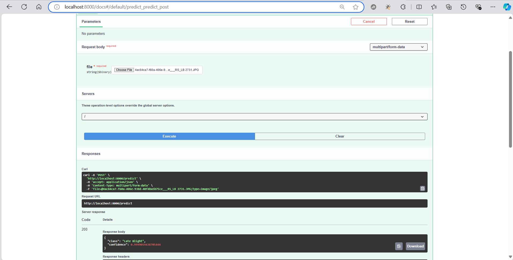
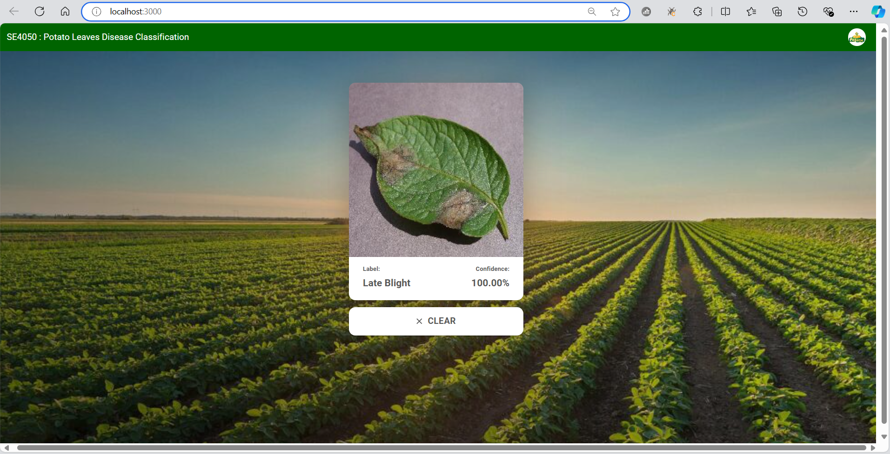
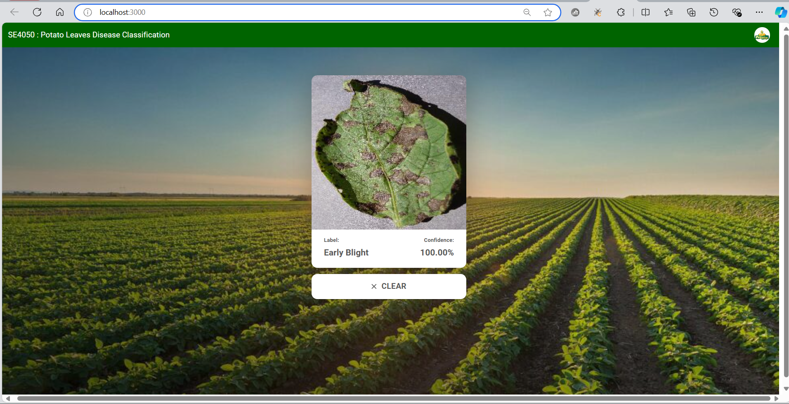
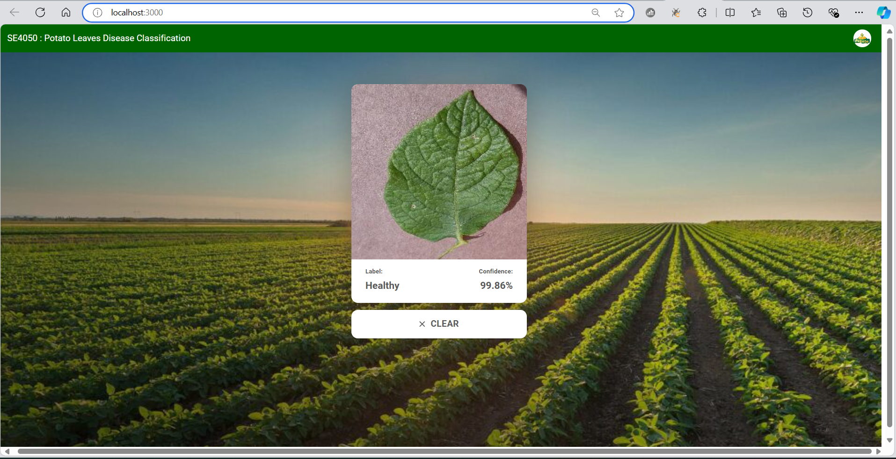

# SE4050 - Deep Learning Assignment

Project Overview
This project focuses on solving the problem of plant disease classification using the Plant Village dataset(Potato images) from Kaggle. We have developed and compared four distinct Convolutional Neural Network (CNN) architectures to classify different plant diseases. This is a supervised learning task aimed at detecting and classifying plant diseases of potatos from leaf images.

Dataset
Dataset: Plant Village Dataset
Images: 54,306 images of plant leaves categorized into 38 classes (healthy and diseased).
Source: Kaggle
Preprocessing: The dataset was resized to 64x64 pixels and normalized to values between [0, 1]. Data augmentation was applied to reduce overfitting.

**Group memebr details:**

IT21251900 - Rajapaksha R.M.S.D

IT21302862 - Sri Samadhi L.A.S.S

IT21178054 - Kumari T.A.T.N

IT21360428 - Monali G.M.N.


**Potato Disease Identification API**

This project uses a machine learning model to identify diseases in potato leaves via a web-based API using FastAPI. The API allows users to upload images of potato leaves and returns a prediction indicating whether the plant is healthy or affected by Early Blight or Late Blight.

How It Works:
Image Upload: Users upload an image of a potato leaf to the /predict endpoint.
Preprocessing: The image is resized and normalized to match the model's input requirements.
Model Prediction: The pre-trained model processes the image and predicts the class of disease (or "Healthy").
Response: The API returns the predicted disease class along with a confidence score.

#Upload file to the predict Endpoint & check the trained model(Late_Blight)



#Upload file to the predict Endpoint & check the trained model(Early_Blight)


#To run the Faster Endpoint application

1.download the neccssary dependencies

2.navigate to the directory (api) & run the below command to start the application

```
uvicorn main:app --host localhost --port 8000 --reload
```

**Potato Disease Identification React Application**

We have developed a React application that helps identify diseases in potatoes using machine learning models. The system integrates a trained model deployed via FastAPI, with the model training done on Google Colab.

#Upload file to the frontend file uploader & check the trained model(Late_Blight)



#Upload file to the frontend file uploader & check the trained model(Early_Blight)



#Upload file to the frontend file uploader & check the trained model(healthy)



#To run the application 

1.run the backend server(FasterAPI - potato-disease-application-python-api)

2.set the environmet

```
$env:NODE_OPTIONS="--openssl-legacy-provider"
```

3.Install the dependencies

```
npm install
```

```
npm audit fix
```

